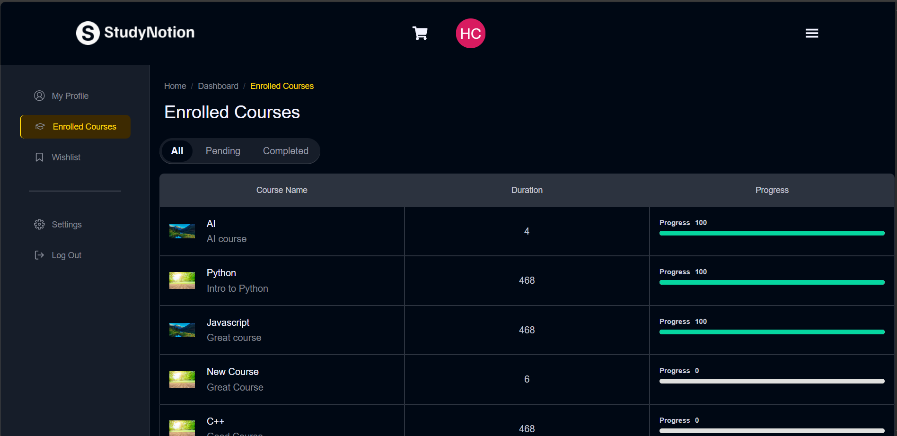
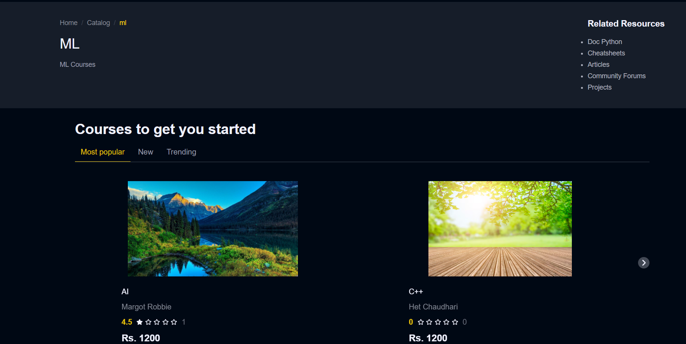

# 📘 StudyNotion

A fully functional **ed-tech platform** that enables users to create, consume, and rate educational content. Built with the **MERN stack**, StudyNotion supports user authentication, course creation, video lectures, payment integration, and more.

---

## 🚀 Live Demo

[StudyNotion](https://study-notion2.vercel.app/)

---


## 🖼️ Screenshots

### 🏠 Home Page


### 📚 Dashboard


### 📖 Courses Page
This page displays all available courses for users. Each course shows its title, description, and preview image. Users can browse and enroll from here.


---

## 🧠 Features

- 🔐 User authentication (login/signup with JWT)
- 🧑‍🏫 Instructor and student dashboards
- 🎓 Course creation and enrollment
- 🎥 Video lectures and module organization
- 💳 Payment integration with Razorpay
- 📊 Progress tracking for enrolled users
- 📱 Fully responsive UI

---

## 🛠️ Tech Stack

**Frontend:**
- ReactJS
- Tailwind CSS
- Redux Toolkit

**Backend:**
- Node.js
- Express.js
- MongoDB
- Cloudinary (for image uploads)

**Other Integrations:**
- Razorpay (for payments)
- JWT (authentication)
- Mongoose (ORM)
- dotenv, nodemailer, bcrypt, etc.

---

## ⚙️ Installation (Local Setup)

```bash
# Clone the repo
git clone https://github.com/hetchaudhari123/StudyNotion2.git

# Navigate into the project directories
cd src
npm install

cd ../server
npm install

## 🔐 Environment Variables

Create a `.env` file inside the `/server` directory with the following environment variables:

```env
# 🌩️ Cloudinary
API_KEY=your_cloudinary_api_key
API_SECRET=your_cloudinary_api_secret
CLOUD_NAME=your_cloudinary_cloud_name
FOLDERNAME=your_cloudinary_folder_name

# 🔐 JWT
JWT_SECRET=your_jwt_secret_key

# 📧 Nodemailer (for sending emails)
MAIL_HOST=your_mail_host
MAIL_PASS=your_mail_password
MAIL_USER=your_mail_username

# 🌐 MongoDB
MONGODB_URL=your_mongodb_connection_url

# 🚀 Backend Server
PORT=4000

# 💳 Razorpay
RAZORPAY_KEY=your_razorpay_key_id
RAZORPAY_SECRET=your_razorpay_secret_key

# 🌐 React App Environment (used in the client)
REACT_APP_BASE_URL=http://localhost:4000
REACT_APP_RAZORPAY_KEY=your_razorpay_key
REACT_APP_RAZORPAY_SECRET=your_razorpay_secret_key

The frontend must have a `.env` file in the **root folder** containing the following variable:

```env
REACT_APP_KEY_OF_RAZOR=your_razorpay_key


# Run the app
npm run dev
